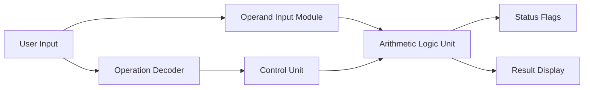
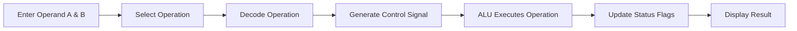

# # ALU & Control Unit Visual Simulator

> **Computer Architecture Project Proposal**  
> **Student:** Ibraheem  
> Architecture Focus: **CPU ALU & Control Logic**

---

## Project Overview

The **ALU & Control Unit Visual Simulator** is a Computer Architecture project that demonstrates how a CPU performs arithmetic and logical operations using an Arithmetic Logic Unit (ALU) and a simple Control Unit.

The project will allow the user to enter two input values, select an operation, and observe the generated control action, ALU result, and status flags.

The goal is to keep the project simple, visual, and easy to understand while demonstrating important CPU architecture concepts.

---

## Proposed 5 Modules

### 1. Operand Input Module
Accepts two input values that will be used by the ALU.

### 2. Operation Decoder
Identifies the selected instruction or operation such as `ADD`, `SUB`, `AND`, `OR`, or `XOR`.

### 3. Control Unit
Generates the control signal required to select the correct ALU operation.

### 4. Arithmetic Logic Unit (ALU)
Performs arithmetic and logical operations on the input values.

### 5. Status Flags & Result Monitor
Displays the final result and important status flags such as Zero, Carry, Negative, and Overflow.

---

## System Architecture



---

## Working Flow



---

## Planned Operations

The first version will support:

```text
ADD
SUB
AND
OR
XOR
Shift Left
Shift Right
Compare
```

More operations can be added later if required.

---

## Final Goal

```text
Input Operands
      +
Control Logic
      +
ALU Operations
      =
ALU & Control Unit Visual Simulator
```

The final project will visually demonstrate how a CPU control unit selects an ALU operation and how the ALU produces a result and status flags.

---

## Current Status

**Status:** Project Selection / Planning Stage  
**Implementation:** Not started yet  
**Next Step:** Implement the five modules and connect them through a simple graphical interface.